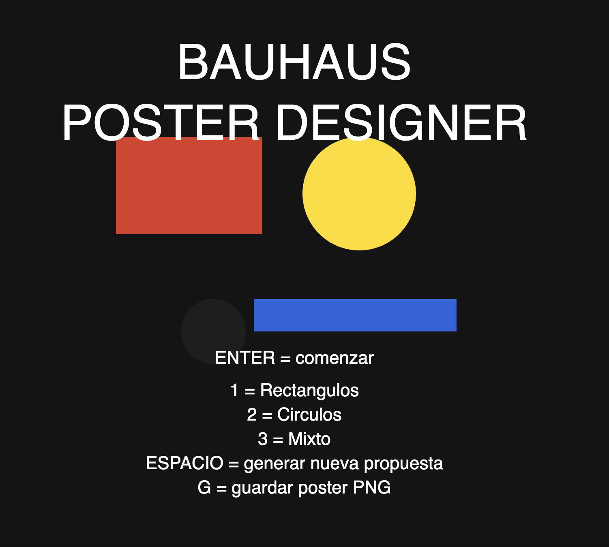

# [Ejemplo examen](https://editor.p5js.org/sofialuisa.xyz/sketches/xdr0tXPx-)




# EJEMPLOS CODIGO vistos en clases

- [Global vs local](https://editor.p5js.org/sofialuisa.xyz/sketches/GdWJ_0Pqd)
- [Variables](https://editor.p5js.org/sofialuisa.xyz/sketches/CMJhQha83)
- [If sin else](https://editor.p5js.org/sofialuisa.xyz/sketches/GxYWiCOOC)
- [Else if](https://editor.p5js.org/sofialuisa.xyz/sketches/vga1njuBl)
- [Comparaciones](https://editor.p5js.org/sofialuisa.xyz/sketches/Db3eOq2Lv)
- [Comparaciones 2](https://editor.p5js.org/sofialuisa.xyz/sketches/AQM7HHN_A)
- [Hello world](https://editor.p5js.org/sofialuisa.xyz/sketches/G-Yu-i-LY)
- [Mondrian 2D - solemne I](https://editor.p5js.org/sofialuisa.xyz/sketches/ttMp6lr5p)
- [webcam](https://editor.p5js.org/sofialuisa.xyz/sketches/dmo6XUm44)
- [video 1](https://editor.p5js.org/sofialuisa.xyz/sketches/YUxgI6Vnw)
- [blend modes](https://editor.p5js.org/sofialuisa.xyz/sketches/_paWI6aZT)
- [tinte gato magenta](https://editor.p5js.org/sofialuisa.xyz/sketches/8vnxdlR9_)
- [image](https://editor.p5js.org/sofialuisa.xyz/sketches/_T00jSjjf)
- [objetos 1](https://editor.p5js.org/sofialuisa.xyz/sketches/qP4iHbXFo)
- [objetos 2](https://editor.p5js.org/sofialuisa.xyz/sketches/76ly_946Z)
- [evento2-key](https://editor.p5js.org/sofialuisa.xyz/sketches/fcdlRGaG3)
- [evento1-mouse](https://editor.p5js.org/sofialuisa.xyz/sketches/8Q90AwD8h)
- [push pop](https://editor.p5js.org/sofialuisa.xyz/sketches/yW93PPhjv)
- [random](https://editor.p5js.org/sofialuisa.xyz/sketches/jJ6E6CvJ0)
- [boolean1](https://editor.p5js.org/sofialuisa.xyz/sketches/4BmcLVrXF)
- [boolean2](https://editor.p5js.org/sofialuisa.xyz/sketches/muFBJdy1o)
- [arreglo1](https://editor.p5js.org/sofialuisa.xyz/sketches/-7jbs1maW)
- [arreglo2](https://editor.p5js.org/sofialuisa.xyz/sketches/vl03FVNum)
- [arreglo3](https://editor.p5js.org/sofialuisa.xyz/sketches/F9zh6aX9y)
- [map](https://editor.p5js.org/sofialuisa.xyz/sketches/BSynr_3rU)
- [key flor](https://editor.p5js.org/sofialuisa.xyz/sketches/q1TDbGHBb)
- [funcion dibujar flor](https://editor.p5js.org/sofialuisa.xyz/sketches/vsv6SSs1V)
- [loop anidado](https://editor.p5js.org/sofialuisa.xyz/sketches/lbUgFyxzd)


# Ejercicios Interactivos — Solemne II
## Pensamiento Computacional / p5.js

> 📣 Repositorio de ejercicios prácticos para entrenar los contenidos técnicos de código en preparación a la solemne II y el examen final. 
>
> Cada ejercicio incluye:
> - Un ejemplo funcional
> - Explicación breve de cada código
> - Desafíos interactivos logrados modificando el código base
>

## Contenidos de ejercicios 

- Input continuo
- Variables
- Loops (`for`)
- Condicionales (`if`)
- Funciones propias
- Uso de `map()`
- Uso de `random()`
- Sistemas visuales dinámicos

---

# 🟢 Ejercicio 1 — Input en combinación con `map()`

## Tema
Transformar un input continuo en un cambio visual.

## Código base

```javascript
function setup() {
  createCanvas(600, 400);
}

function draw() {
  background(240);

  // map transforma mouseX en un tamaño
  let tamano = map(mouseX, 0, width, 20, 200);

  ellipse(width / 2, height / 2, tamano);
}
```

---

## Qué hace este ejemplo

- Usa `mouseX` como input continuo
- Usa la función  `map()` para transformar valores. La [función map](https://p5js.org/examples/calculating-values-map/), como dice su nombre, mapea los valores de un rango a otro. En este caso mapea el valor de mouseX que va de 0 al ancho de la pantalla, entre 20 a 200. 
- El círculo cambia de tamaño según el valor mapeado del mouse. 

---

## Ahora en base a esté código, intenta:

### Parte 1:
Hacer que el color también cambie usando `mouseY`.

---

### Parte 2
Agrega un segundo círculo:

- Más pequeño
- En otra posición
- Que también reaccione al mouse

---

### Parte 3
Haz que:

- Mientras más abajo esté el mouse más transparente sea el círculo

---

# 🟡 Ejercicio 2 — Loops (`for`)

## Tema
Repetición y sistemas.

---

## Código base

```javascript
function setup() {
  createCanvas(600, 400);
}

function draw() {
  background(240);

  // loop que repite círculos
  for (let x = 50; x < width; x += 50) {
    ellipse(x, height / 2, 30);
  }
}
```

---

## Qué hace este ejemplo

- Usa un loop `for`
- Repite una misma instrucción muchas veces
- Construye una estructura visual repetitiva

---

## Ahora haz esto

### Parte 1
Usa `mouseX` para cambiar:

- el tamaño de los círculos
- o la separación entre círculos

---

### Parte 2
Convierte la fila en una grilla:

- Agregar un segundo loop (nested loop)
- Usar variables `x` e `y`

---

### Parte 3
Haz que:

- algunas formas sean círculos
- otras cuadrados
- Usa un condicional `if`.

---

# 🟠 Ejercicio 3 — Condicionales (`if`)

## Tema
Construir reglas.

---

## Código base

```javascript
function setup() {
  createCanvas(600, 400);
  rectMode(CENTER);
}

function draw() {
  background(240);

  // regla visual
  if (mouseX < width / 2) {
    ellipse(width / 2, height / 2, 120);
  } else {
    rect(width / 2, height / 2, 120, 120);
  }
}
```

---

## Qué hace este ejemplo

- Usa una condición
- El sistema toma decisiones
- Cambia comportamiento según input

---

## Ahora haz esto

### Parte 1
Haz que:

- izquierda → círculo rojo
- derecha → cuadrado azul

---

### Parte 2
Agrega otra condición:

- arriba → formas pequeñas
- abajo → formas grandes

---

### Parte 3
Haz que aparezca una tercera forma.

Ejemplo:

- triángulo
- línea
- texto

---

# 🔵 Ejercicio 4 — `random()`

## Tema
Variación y comportamiento generativo.

---

## Código base

```javascript
function setup() {
  createCanvas(600, 400);
  noStroke();
}

function draw() {
  background(240);

  for (let i = 0; i < 100; i++) {

    // posición aleatoria
    let x = random(width);
    let y = random(height);

    // tamaño aleatorio
    let tamano = random(10, 50);

    fill(0, 100, 200, 120);
    ellipse(x, y, tamano);
  }
}
```

---

## Qué hace este ejemplo

- Usa la función `random()`. La [función random()](https://p5js.org/reference/p5/random/)en p5.js es una herramienta fundamental utilizada para generar números aleatorios entre un mínimo y un máximo, o en este ejemplo entre 0 y un valor determinado por variables como width y height. 
- Cada frame produce una composición distinta
- El resultado nunca es idéntico

---

## Ahora haz esto

### Parte 1
Haz que el color también sea aleatorio.

---

### Parte 2
Usa un condicional:

- círculos grandes → color rojo
- círculos pequeños → color negro

---

### Parte 3
Haz que:

- el mouse controle la cantidad de círculos usando `map()`.

---

# 🟣 Ejercicio 5 — Funciones

## Tema
Organizar sistemas usando funciones.

---

## Código base

```javascript
function setup() {
  createCanvas(600, 400);
}

function draw() {
  background(240);

// los valores x e y se declaran acá y luego se pasan a la función abajo
  dibujarForma(150, 200);
  dibujarForma(300, 200);
  dibujarForma(450, 200);
}

// función propia
function dibujarForma(x, y) {
//el primero toma los valores x:150 y y:200, luego x:300 y y:200, y luego x:450 y y:200
  ellipse(x, y, 80);
}
```

---

## Qué hace este ejemplo

- Usa una función propia
- Evita repetir código
- Encapsula comportamiento

---

## Ahora haz esto

### Parte 1
Haz que la función dibuje:

- más de una forma
- o una composición pequeña

---

### Parte 2
Haz que la función use:

- color
- tamaño
- rotación

---

### Parte 3
Agrega parámetros nuevos.

Ejemplo:

```javascript
function dibujarForma(x, y, tamano, color)
```

